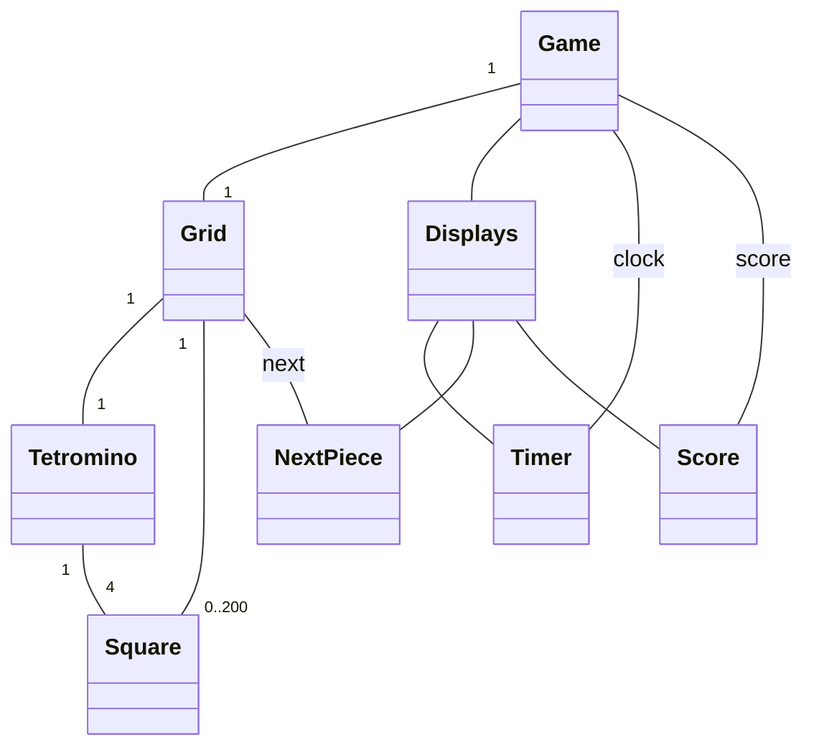
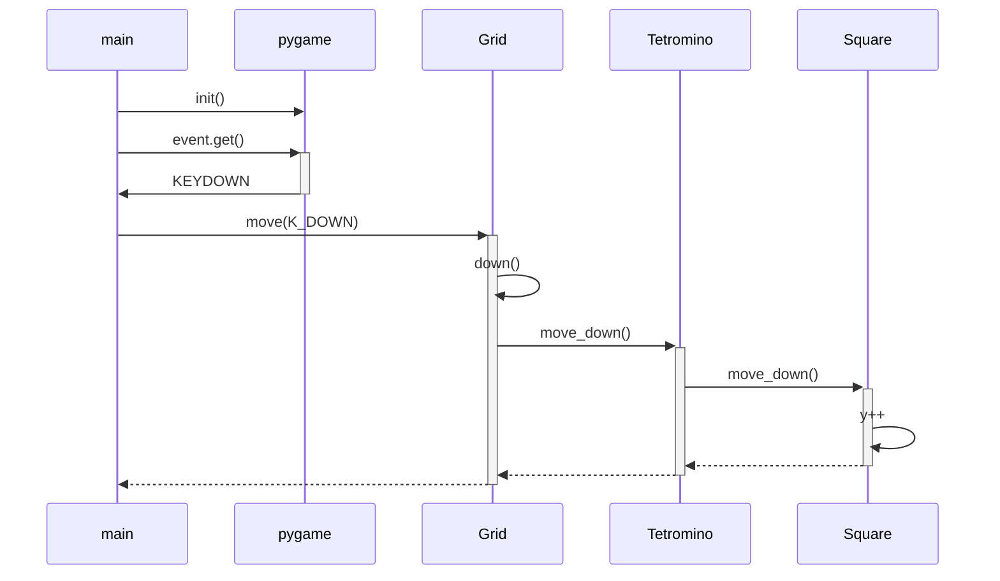

## Luokkarakenne

```mermaid
classDiagram
    Game "1" -- "1" Grid
    Grid "1" -- "1" Tetromino
    Grid "1" -- "0..200" Square
    Tetromino "1" -- "4" Square
    
    Game -- Displays
    Displays -- Timer
    Game -- Timer: clock
    Displays -- NextPiece
    Grid -- NextPiece: next
    Displays -- Score
    Game -- Score: score
```

## Toimintaesimerkki (näppäinpainallus)

```mermaid
sequenceDiagram
    main ->> pygame: init()
    main ->>+ pygame: event.get()
    pygame ->>- main: KEYDOWN
    
    main ->>+ Grid: move(K_DOWN)
    Grid ->> Grid: down()
    Grid ->>+ Tetromino: move_down()
    Tetromino ->>+ Square: move_down()
    Square ->> Square: y++
    Square -->>- Tetromino: 
    Tetromino -->>- Grid: 
    
    Grid -->>- main: 
```