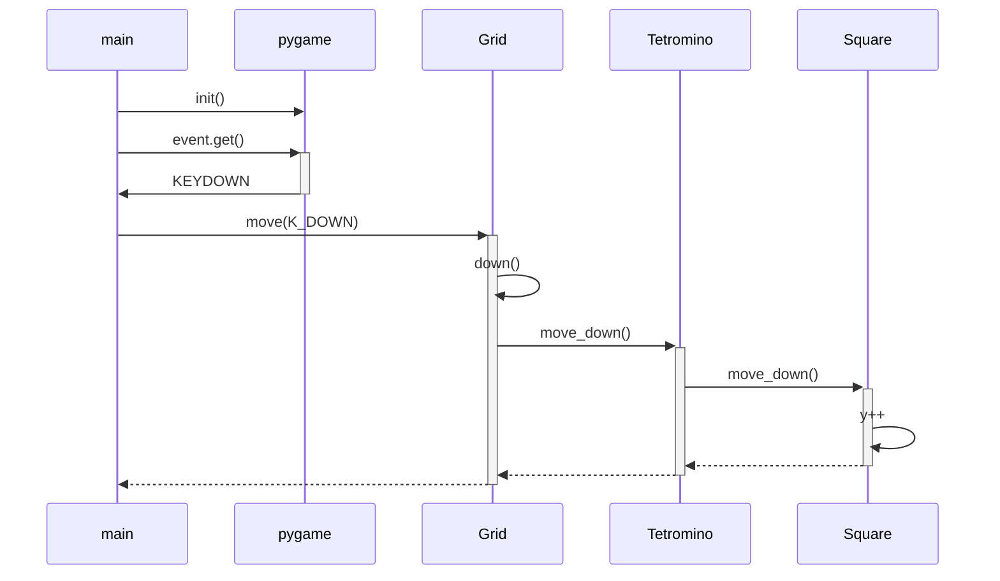
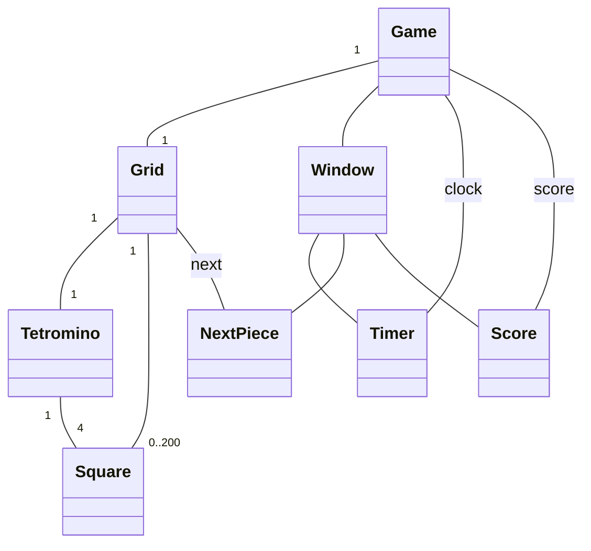

# Arkkitehtuuri

## Rakenne
Sovellus on pilkottu kahteen hakemistoon. Hakemisto *game* vastaa pelin logiikasta
ja *ui* käyttöliittymästä. 

## Käyttöliittymä
Käyttöliittymästä vastaa [Window-luokka](../src/ui/window.py), jonka konstruktori alustaa ikkunan ja
elementtien kokoihin/sijoitteluihin liittyviä muuttujia. Jokainen UI-elementti
on oma metodinsa, ja niitä kutsutaan `render`-metodista, jota itsessään
kutsutaan main-funktiosta joka ruudunpäivityksellä.

Window-luokalla on suora pääsy pelilogiikasta vastaavaan Grid-objektiin,
sillä `_render_grid()` ja `_render_peek()` -metodit vaativat ajantasaisen tiedon
siitä, mitä pelissä kullakin hetkellä tapahtuu.

## Pelilogiikka
Yksinkertaisin pelilogiikan luokka on [Square](../src/game/square.py). Square-luokka
sisältää tiedon omasta sijainnistaan ruudukossa ja värinsä, sekä metodit
liikkumista varten.

Luokka [Tetromino](../src/game/tetromino.py) koostuu nimensä mukaisesti neljästä
Squaresta. Luokkaa käytetään uuden ohjattavan palikan synnyttämiseen sekä
ohjaamiseen. Se arpoo satunnaisesti muodon, synnyttää muodon mukaisesti
oikeanväriset Squaret oikeaan paikkaan, ja säilyttää ne listassa.
Liikkumiseen suunnatut metodit kutsuvat vain samoja metodeja yksittäisissä
Squareissa, ja kääntämiseen tarkoitettu metodi `rotate()` soveltaa trigonometriaa
muodon kiertämiseen tietyn "akselineliön" ympäri.

Pelin toiminnallisuuden yhteenkokoaa luokka [Grid](../src/game/grid.py). Se
sisältää aktiivisen ja jonottavan palikan Tetromino-olioina, listan sille
jo luovutetuista Squareista, sekä erillisen koordinaatiston niiden kartoittamisen
helpottamiseksi. Luokka vastaa toiminnallisuudesta `tick()`-metodilla, joka
hoitaa kaikki kerran *tickissä* tapahtuvat asiat, kuten pelipalikan hitaan putoamisen.
Metodi `move()` kartoittaa pelaajan näppäinpainallukset tiettyihin toimintoihin,
kuten seuraavassa kaaviossa on selitetty:

## Luokkarakenne

Ohessa on kaavio alustavasti suunnitellusta luokkarakenteesta. Tästä on jo
hieman poikettu sikäli, että erillistä Game-luokkaa ei ole, vaan kaikesta
pelitilan säilytyksestä vastaa Grid. Lisäksi Window-luokan elementeille
ei ainakaan vielä ole omia alaluokkia.

