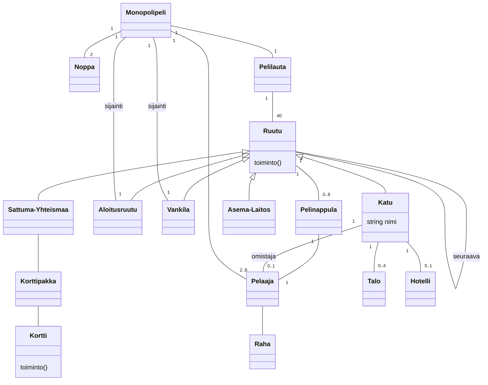

## Monopoli, luokkakaavio

Alustava kaavio otettu kurssimateriaalista ja laajennettu

```mermaid
 classDiagram
    Monopolipeli "1" -- "2" Noppa
    Monopolipeli "1" -- "1" Pelilauta
    Pelilauta "1" -- "40" Ruutu
    Ruutu "1" -- "1" Ruutu : seuraava
    Ruutu "1" -- "0..8" Pelinappula
    Pelinappula "1" -- "1" Pelaaja
    Pelaaja "2..8" -- "1" Monopolipeli
    
    Ruutu <|-- Aloitusruutu
    Ruutu <|-- Vankila
    Ruutu <|-- Sattuma-Yhteismaa
    Ruutu <|-- Asema-Laitos
    Ruutu <|-- Katu
    Sattuma-Yhteismaa -- Korttipakka
    Korttipakka -- Kortti
    Kortti : toiminto()
    
    Monopolipeli "1" -- "1" Aloitusruutu : sijainti
    Monopolipeli "1" -- "1" Vankila : sijainti
    Katu : string nimi
    Ruutu : toiminto()
    
    Katu "1" -- "0..4" Talo
    Katu "1" -- "0..1" Hotelli
    Katu "1" -- "0..1" Pelaaja : omistaja
    Pelaaja -- Raha
```